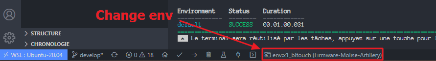
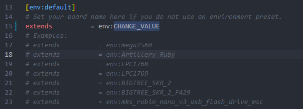
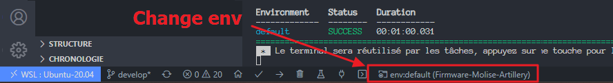

# Molise Firmware

Youtube Channel : [Dtcreation 3D](https://www.youtube.com/channel/UCQOsiY8l6Of56zkFhtDT0Sw)

Facebook group : [Molise Firmware](https://www.facebook.com/groups/molisefirmware)

TFT Firmware :  [Github repository](https://github.com/Dtcreation/Firmware-Molise-TFT)

## FRENCH

### Qu'est ce que le firmware Molise

Molise est un firmware modifié pour les imprimantes de la marque [Artillery](https://artillery3d.com/). Le firmware support atuellement les Sidewinder X1 et X2, les Genius et Genius Pro et la Hornet.

Le Firmware est découpé en 2 parties

- Pour la carte mère : Marlin Molise
- Pour l'écran TFT : Basé sur le firmware de Bigtreetech. [Sources disponible ici](https://github.com/Dtcreation/Firmware-Molise-TFT)

## ENGLISH

### What is Molise firmware

Molise is modified firmware for brand printers [Artillery](https://artillery3d.com/). The firmware also supports Sidewinder X1 and X2, Genius and Genius Pro and la Hornet.

Firmware is split in 2

- For the motherboard: Marlin Molise
- For TFT screen: Based on Bigtreetech firmware. [Sources available here](https://github.com/Dtcreation/Firmware-Molise-TFT)

## Current version

Latest version of Molise __4.0__ based on [Marlin 2.1.1-bugfix](https://github.com/MarlinFirmware/Marlin/releases/tag/2.0.9.3)

## About Molise Firmware

Molise firmware is provided to you free of charge in an "as is" state. We cannot be held responsible for any damage it may do to your 3D printer if it occurs. Please proceed with caution.

## Marlin Printer Firmware

Molise has a simple and advanced configuration assistant in 7 sections.

Supported Artillery printers :

- Genius
- Genuis Pro
- Sidewinder X1
- Sidewinder X2
- Hornet

Supported boards :

- Stock Board for Genuis and X1
- Stock Board for Genuis Pro, X2 and Hornet
- MKS GEN L V2.1, SGEN L V1, SGEN L V2, ROBIN NANO V3
- BigTreeTech SKR 1.3, SKR 1.4, SKR 1.4 Turbo, SKR 2.0 (Rev A and B)

Supported drivers :

- TMC 2208
- TMC 2209
- LV8729

Supported Extruders :

- Titan (Stock Extruder)
- BMG, BMG Wind
- HEMERA
- Matrix

Others supported Options :

- BlTouch (High Speed Mode, 5x5)
- TouchMi with or without LED on X1
- GraphicalLCD
- Sensorless Homing
- MBL
- M600 & Nozzle Park / Advanced Pause
- NeoPixels
- PID Tune
- EEPROM
- Linear Advance
- S Curve Acceleration
- ABL Bilinear Subdivision
- Z Steppers Auto-Alignment (G34)
- Mesh Validation Pattern (G26)
- Etc ...

## How to download Firmware

Go to [Release](https://github.com/Dtcreation/Firmware-Molise-Artillery/releases) and download needest release

ℹ️ - About precompiled Firmwares

All firmwares are manually precompiled with options :

- Default Enabled :

  - Stock drivers
  - Stock boards
  - Stock extruders
  - Linear Advance (default : K0.12)
  - Classic Jerk
  - PID Temp
  - M600 - Advanced Pause for Filament Change
  - Restore leveling after G28
  - BLtouch (only BLtouch version)
  - Babystepping
  - G26 Mesh Validation Pattern tool
  - EEPROM - Persistent storage to preserve configurable settings across reboots.
  - Nozzle Park
  - SD Card support + CRC checks and retries on the SD communication
  - G2/G3 Arc Support

- Disabled (if you want to enabled this options, you need to compile from sources):

  - High Speed BLTouch
  - S Curve Acceleration
  - Auto Bed Leveling 49 points (7x7)
  - Z Steppers Auto-Alignment

# Firmware Update

## TFT Firmware Update

### TFT Firmware Installation

In order to install the TFT firmware:

1. Download the firmware
2. Unzip the archive and copy the contents to the SD Card. The folder `TFT28` and file `MKSTFT28.bin` must be on the root folder of the SD card
3. Plug in the SD card into the printer
4. Turn on the printer and wait for the firmware to finish flashing
5. In case calibration procedure is started, touch the calibration points on the screen
6. Restart the printer
7. Proceed with the configuration as reported on section [TFT Firmware Configuration](#TFT-Firmware-Configuration)

IMPORTANT NOTE: Always install all the content provided in the zip file. That means, copy in the SD card the .bin + config.ini + TFT28 folder with its files. In addition (optional) also the desired language_xx.ini file can be provided in the root folder of the SD card. All the language files are found in the Language_Packs folder.

### TFT Firmware Configuration

To update the TFT firmware configuration:

1. Edit the settings in `config.ini`. See the comments on the file to properly set each setting
2. Copy the `config.ini` file to the root folder of the SD card. (The SD card capacity should be less than or equal to 8GB and formatted as FAT32)
3. Insert the SD card in the TFT's SD card slot and restart the TFT by pressing the reset button (if you have a Sidewinder X1 v4 or above printer revision) or switching off and on the printer
4. The TFT will load the configuration from `config.ini` file and store it on internal SPI flash. That means the configuration will be loaded from SPI flash on all the next printer reboots (no need to provide the configuration file on the SD card unless you make changes on `config.ini` file and want to load the new configuration)

## Installation and configuration

In order to help you in installing and configuring the Firmware, please take a look at the [Wiki](https://github.com/Dtcreation/Firmware-Molise-Artillery/wiki)

First, you need to install / update TFT Firmware, and after that you will update Marlin with Molise version. 

### TFT Firmware Not Attached

If the text:

    No printer attached!

is displayed on top of the display it means you need to change the value for the **UART speed** setting. By default it is set to **250000**. Change it from TFT menu **Menu->Settings->Connection->S. Ports**, wait few seconds in order to check that with the selected UART speed the error message disappears. Once the message disappears it means that the TFT firmware is now connected to the printer and you can use it.

### TFT Firmware Rollback

In case you have issues with this custom firmware or you don't like it, you can rollback to the firmware previously installed in your printer.

In order to rollback:

1. Download the stock Artillery TFT firmware (from https://artillery3d.com) or any other custom TFT firmware you had previously installed in your printer
2. Unzip the archive and copy the contents to the SD Card. The contents must be on the root folder of the SD card
3. Plug in the SD card into the printer
4. Turn on the printer and wait for the firmware to finish flashing
5. Restart the printer

### About TFT Screen Firmware

The Molise Firmware is supplied with a second firmware, this is the firmware of the TFT screen. This TFT Firmware is based on the Official Firmware of Bigtreetech with the support among others of the following touch functions:

- M600
- Babystepping
- ABL
- MBL
- Z Offset
- Autotune PID
- Assisted filament loading-unloading
- Assisted E-step calibration
- UART management
- Various configurations

## Install / Update Molise : Marlin

On Sidewinder X1 and Genius printers, the mainboard's USB port used to connect the printer to a PC (e.g. to OctoPrint) is wired to a serial bus. This bus is also shared by both TFT and mainboard. The sharing of the serial bus does not allow to easily flash Marlin firmware due to collisions in the bus.

Two possible solutions were normally adopted to allow Marlin firmware updates:

1. Physical disconnection of the TFT serial cable so the serial bus is no more shared with the TFT. This solution requires to remove the cover under the chassis and possibly to loose any warrenty
2. Use a script under Linux OS trying to lock the serial bus to the TFT

This TFT firmware provides a third, and easy to use, solution for flashing Marlin firmware.

In order to flash Marlin firmware, follow the steps below in the same order they are reported:

1. Switch on the printer from the main power button (on the back of the printer)
2. From the TFT, press on button **Menu->Settings->Connection->Disconnect**. A black background with a text asking to touch the screen to connect again the TFT is prompted. **DO NOT** press on the display, so the TFT will continue to be disconnected from the serial bus
3. From the PC, open the application you usually use for flashing Marlin firmware (e.g. PrusaSlicer)
4. Plug a USB cable from the PC to the mainboard's USB port and connect the application to the printer
5. Follow the instructions provided by your application to flash Marlin firmware
6. Once Marlin firmware is flashed, disconnect the application from the printer and restart the printer (switching off and on or pressing on the TFT's reset button if you have a Sidewinder X1 v4)

#### Marlin Firmware Configuration

After a new Marlin firmware is installed (see section [Marlin Firmware Installation](#Marlin-Firmware-Installation)), EEPROM must always be reset and the following setups have to be performed again and saved to EEPROM after completion:

1. Reset EEPROM, from **Menu->Settings->Machine->EEPROM->Reset** button
2. Perform **PID** process, from **Menu->Settings->Machine->Tuning->PID** menu
3. Perform **Probe Offset** process (only for BLTouch Marlin firmware versions), from **Menu->Movement->Bed Level->P Offset** menu
4. Perform **Bed Leveling** process, from **Menu->Movement->Bed Level->UBL** (or MBL) menu
5. Save to EEPROM, from **Menu->Settings->Machine->EEPROM->Save** button

### Disconnect TFT screen

This solutions have normally been adopted to allow Marlin firmware updates with a prerequisite, disconnecting the black and red cable from the TFT screen (definitely, this cable is mainly used to block the flash):

Physical disconnection of the TFT serial cable so that the serial bus is no longer shared with the TFT. This solution requires removing the cover under the chassis and possibly losing all warranty.

See image below, and disconnect TFT1 (original connection)

### Change the port of the TFT on the mainboard to avoid conflict with Octoprint

When you use Octoprint with a custom firmware, you have a conflict with the TFT display. On Sidewinder X1 and Genius printers, the mainboard's USB port used to connect the printer to a PC (e.g. to Octoprint) is wired to a serial bus. This bus is also shared by both TFT and mainboard. To install a new firmware, you need to disconnect the TFT by opening the printer each time. So you can change the port of the TFT on another slot of the mainboard MKS to avoid any conflict in the future.

- Deport the TFT connection to the EXP1 port, you can then flash without any worries

## Board update

### MKS SGEN L 

#### Artillery Genius MKS SGEN L 1.0 MotherBoard

Diagram to move from MKS GEN L 1.0 to MKS SGEN L 1.0

 

# How to build

## VSCode

The simplest way to build is to switch the PlatformIO project environment in VSCode (as the screenshot below) and use one of the presets:

- For the Sidewinder X1:
  - __env:x1_mbl__: with Mesh Bed Leveling
  - __env:x1_bltouch__: with BL Touch
  - __env:x1_touchmi__: with Touch Mi
- For the Genius:
  - __env:genius_mbl__: with Mesh Bed Leveling
  - __env:genius_bltouch__: with BL Touch
  - __env:genius_touchmi__: with Touch Mi
- For the Sidewinder X2: __env:x2__
- For the Genius Pro: __env:geniuspro__
- For the Hornet: __env:hornet__

If you're using VSCode extension for PlatformIO, you should be able to pick the environment you want directly from the bottom bar.

If you need more fined-grained configuration (e.g. custom board or custom extruder), you may stay on the default PlatformIO environment and follow through the instructions in [Marlin/Configuration.h](Marlin/Configuration.h). To build custom Molise Firmware, replace "CHANGE_VALUE" in [platformio.ini](platformio.ini) with the required configuration, save file and change platform.io env to `default`

The code in the `Configuration.h` file has been split into 7 sections to make the code more readable. So, for people who want to compile code from source, the job will be easier. For more explanation on the code compilation, please refer to the [dedicated wiki](https://github.com/Dtcreation/Firmware-Molise-Artillery/wiki)

## PIO Command Line Interface

You can also build from `pio` command line directly, for instance:

> pio run -e x1_mbl

# Thanks

Molise Firmware is provided to you by David TOUTON, Thomas Bourcey and [the awesome 3D printing community on Facebook](https://www.facebook.com/groups/molisefirmware), and of course, we can't forget the team Marlin who spent countless days, nights and years building Marlin to where it is today.
